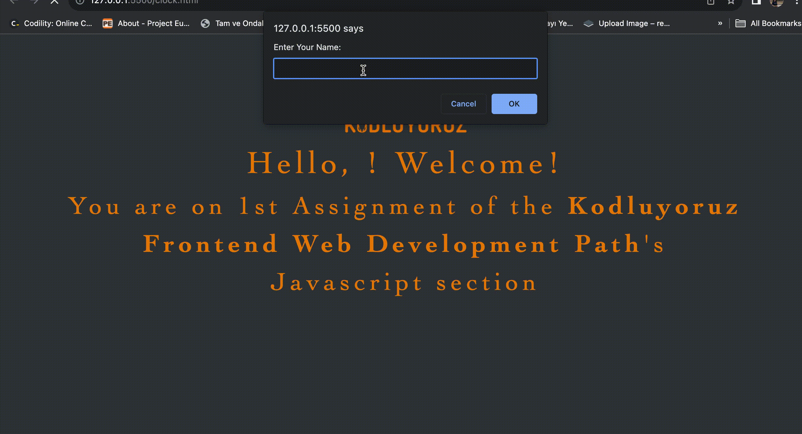
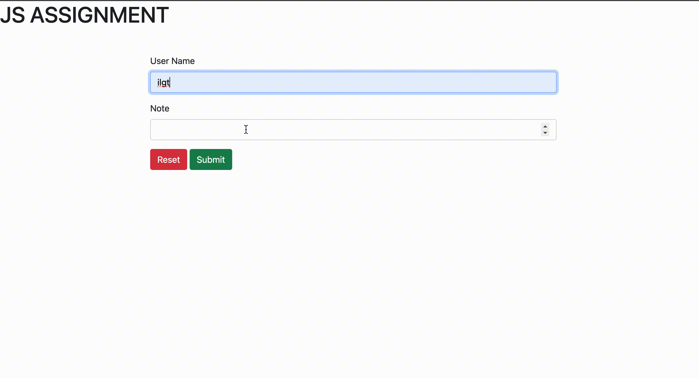

# KODLUYORUZ_JS

## This repository contains 6 simple JavaScript assignments. 

* 1st => In Clock file, You can find clock and greeting application in which prompts the user for their name and then displays a greeting message with the user's name and the current time and date.

* 2nd => In Condition exercise file contains a condition assignment that display the grade information based on your input

* 3rd => In Array file, You can find the array practices which is given from Kodluyoruz.org

* 4th => In TO-DO-LIST file contains basic list include localstorage exercise

* 5th => Kitchen menu

* 6th => Form 

